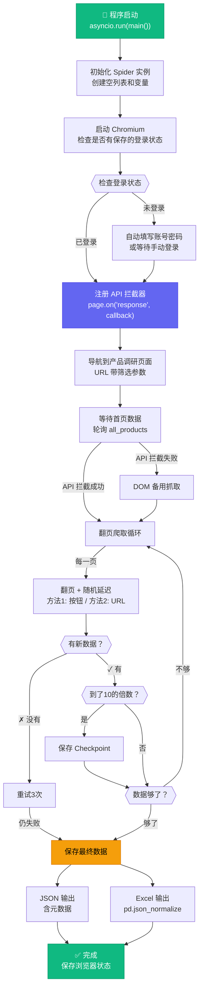

# 🔬 SellerSprite 爬虫代码逐行解析

> 三个文件完整解读：`config.py` → `test_login.py` → `sellersprite_spider.py`
> 每一行代码都会告诉你**它是什么**、**为什么这样写**。

---

## 目录

- [文件一：config.py — 配置中心](#文件一configpy--配置中心)
- [文件二：test_login.py — API 探测脚本](#文件二test_loginpy--api-探测脚本)
- [文件三：sellersprite_spider.py — 主爬虫](#文件三sellersprite_spiderpy--主爬虫)
  - [第一部分：导入和初始化 (L1-57)](#第一部分导入和初始化-l1-57)
  - [第二部分：主运行流程 (L59-142)](#第二部分主运行流程-l59-142)
  - [第三部分：登录流程 (L144-351)](#第三部分登录流程-l144-351)
  - [第四部分：API 拦截器 (L353-447)](#第四部分api-拦截器-l353-447)
  - [第五部分：页面导航 (L449-527)](#第五部分页面导航-l449-527)
  - [第六部分：等待数据加载 (L528-578)](#第六部分等待数据加载-l528-578)
  - [第七部分：翻页爬取 (L580-686)](#第七部分翻页爬取-l580-686)
  - [第八部分：DOM 备用抓取 (L688-717)](#第八部分dom-备用抓取-l688-717)
  - [第九部分：数据保存与去重 (L719-826)](#第九部分数据保存与去重-l719-826)

---

# 文件一：config.py — 配置中心

> [打开文件](file:///d:/snf/git/scrapy/config.py) | 72 行 | 作用：集中管理所有可调节参数

```python
# -*- coding: utf-8 -*-
```
> **L1** — 文件编码声明。告诉 Python 解释器这个文件使用 UTF-8 编码，确保中文注释不会乱码。虽然 Python 3 默认就是 UTF-8，但显式声明是好习惯。

```python
"""
SellerSprite 爬虫配置文件
"""
```
> **L2-4** — 模块文档字符串（docstring）。用三引号包裹的多行注释，描述这个文件的用途。`import config` 后可以通过 `config.__doc__` 查看。

---

### 登录信息区

```python
SELLERSPRITE_USERNAME = "PK6777"   # 填写你的用户名/邮箱
SELLERSPRITE_PASSWORD = "PK6777"   # 填写你的密码
```
> **L9-10** — 账号密码。采用**模块级常量**命名规范（全大写+下划线）。
>
> ⚠️ **安全提示**：生产环境不应在代码中硬编码密码，应该用环境变量 `os.environ.get("SS_PASSWORD")` 或 `.env` 文件。

---

### 爬取参数区

```python
MARKET = "US"
```
> **L16** — 目标市场。SellerSprite 支持多个亚马逊站点（US/UK/DE/JP等），这里只爬美国站。

```python
CATEGORY_NODE_ID = "15684181"
CATEGORY_NAME = "Automotive"
```
> **L19-20** — 亚马逊分类节点。`15684181` 是 Amazon Automotive 品类的唯一ID。每个品类在亚马逊内部都有一个数字 ID，卖家精灵使用这些 ID 来筛选数据。

```python
PAGE_SIZE = 60
```
> **L23** — 每页条数。卖家精灵 API 最大支持 60 条/页。设大一些可以减少翻页次数（减少请求量 = 减少被封概率）。

```python
MIN_SALES = 100
```
> **L26** — 最小月销量。只爬取月销量 ≥ 100 的产品，过滤掉低销量的长尾产品，减少无效数据。

```python
ORDER_FIELD = "amz_unit"   # 按亚马逊销量排序
ORDER_DESC = True           # 降序
```
> **L29-30** — 排序规则。`amz_unit` 是卖家精灵 API 中"亚马逊销量"字段的代号。降序 = 从多到少，优先获取高销量产品。

```python
MAX_PRODUCTS = 10000
```
> **L33** — 爬取上限。设置天花板防止无限爬取。10000 ÷ 60 ≈ 167 页。

---

### 网络与重试区

```python
PAGE_TIMEOUT = 60000    # 毫秒 = 60秒
API_TIMEOUT = 30000     # 毫秒 = 30秒
```
> **L39-42** — 超时设置。Playwright 用毫秒为单位。页面加载给了 60 秒（有些页面JS很重），API 响应给了 30 秒。

```python
PAGE_DELAY_MIN = 3
PAGE_DELAY_MAX = 6
```
> **L45-46** — 翻页间隔。每翻一页随机等待 3~6 秒。**随机**是关键 — 固定间隔会被反爬系统识别为机器行为。

```python
MAX_RETRIES = 3
```
> **L49** — 最大重试次数。翻页失败时最多重试 3 次再放弃。

---

### 输出配置区

```python
import os
from datetime import datetime

OUTPUT_DIR = os.path.join(os.path.dirname(__file__), "data", "automotive")
```
> **L54-57** — 输出目录。`os.path.dirname(__file__)` 获取当前文件（config.py）所在目录，然后拼接 `data/automotive/`。用 `os.path.join()` 而非字符串拼接，确保跨平台兼容（Windows 用 `\`，Linux 用 `/`）。

```python
OUTPUT_FILENAME = f"sellersprite_automotive_{datetime.now().strftime('%Y%m%d_%H%M%S')}"
```
> **L58** — 输出文件名。用 f-string 和 `strftime` 生成带时间戳的文件名，如 `sellersprite_automotive_20260415_134900`。每次运行产生不同文件名，避免覆盖历史数据。

---

### 浏览器设置区

```python
HEADLESS = False
```
> **L63** — 无头模式开关。`False` = 显示浏览器窗口（调试用，可以看到爬虫在干什么）；`True` = 隐藏窗口（生产环境用，节省资源）。

```python
BROWSER_STATE_DIR = os.path.join(os.path.dirname(__file__), "browser_state")
```
> **L64** — 浏览器状态保存目录。Playwright 可以把 cookie、localStorage 等保存到文件，下次启动直接恢复登录状态，避免每次都重新登录。

---

### URL 配置区

```python
BASE_URL = "https://www.sellersprite.com"
LOGIN_URL = f"{BASE_URL}/v3/login"
PRODUCT_RESEARCH_URL = f"{BASE_URL}/v3/product-research"
```
> **L69-71** — 网站 URL。所有 URL 都基于 `BASE_URL` 构建，如果域名变了只需改一处。`/v3/` 是卖家精灵的 v3 版本前台路由。

---

# 文件二：test_login.py — API 探测脚本

> [打开文件](file:///d:/snf/git/scrapy/test_login.py) | 163 行 | 作用：在正式爬取前，先登录并探测 API 结构

> [!TIP]
> 这个脚本的设计思路很值得学习：在写爬虫之前，先写一个**探测脚本**搞清楚目标网站的 API 接口和数据结构，再去写正式的爬虫。

```python
# -*- coding: utf-8 -*-
"""
快速测试脚本 - 先登录并探测 SellerSprite API 结构

用途:
    1. 验证登录是否正常
    2. 发现真实的 API 端点和数据结构
    3. 保存一份样本数据

运行: python test_login.py
"""
```
> **L1-11** — 文件声明和文档字符串。清晰说明了这个脚本的三个用途。

```python
  import asyncio
import json
import os
from datetime import datetime

from playwright.async_api import async_playwright

import config
```
> **L13-20** — 导入依赖。
> - `asyncio`：Python 异步编程核心库，Playwright 的异步 API 需要它
> - `json`：处理 JSON 数据的序列化/反序列化
> - `os`：文件和目录操作
> - `datetime`：时间处理
> - `playwright.async_api`：Playwright 的异步接口（另有同步版 `sync_api`）
> - `config`：导入我们的配置文件
>
> ⚠️ **注意**：L13 有一个缩进错误（`import asyncio` 前面多了两个空格），实际运行可能报 `IndentationError`。

---

### 主测试函数

```python
async def test():
    """测试登录并探测 API"""
```
> **L23-24** — 用 `async def` 定义异步函数。整个测试流程是异步的，因为 Playwright 的操作（如打开页面、等待加载）都需要等待。

```python
    print("=" * 60)
    print("SellerSprite 登录测试 & API 探测")
    print("=" * 60)
```
> **L25-27** — 启动提示。`"=" * 60` 生成 60 个等号作为分隔线，让终端输出更易读。

```python
    os.makedirs(config.OUTPUT_DIR, exist_ok=True)
    os.makedirs(config.BROWSER_STATE_DIR, exist_ok=True)
```
> **L29-30** — 创建输出目录。`exist_ok=True` 表示如果目录已存在就不报错（否则会抛 `FileExistsError`）。

```python
    captured_apis = []
```
> **L32** — 初始化一个空列表，用来收集所有捕获到的 API 调用信息。

---

### 浏览器启动与配置

```python
    async with async_playwright() as pw:
        browser = await pw.chromium.launch(headless=False)
```
> **L34-35** — 启动 Playwright 和 Chromium 浏览器。
> - `async with` 是异步上下文管理器，确保 Playwright 在退出时正确清理资源
> - `headless=False` 显示浏览器窗口，因为需要手动登录

```python
        context = await browser.new_context(
            viewport={"width": 1920, "height": 1080},
            user_agent=(
                "Mozilla/5.0 (Windows NT 10.0; Win64; x64) "
                "AppleWebKit/537.36 (KHTML, like Gecko) "
                "Chrome/131.0.0.0 Safari/537.36"
            ),
        )
```
> **L36-43** — 创建浏览器上下文。
> - **viewport**：设置窗口分辨率为 1920×1080（全高清），模拟正常用户
> - **user_agent**：伪装成 Chrome 131 浏览器。如果用 Playwright 默认的 UA，会包含 "Headless" 字样，容易被识别为爬虫

```python
        page = await context.new_page()
```
> **L44** — 在上下文中打开一个新标签页。这就是我们后续操作的浏览器页面。

---

### 网络请求监听

```python
        async def on_response(response):
            url = response.url
            if response.status != 200:
                return
```
> **L47-50** — 定义响应回调函数。每当浏览器收到一个 HTTP 响应，这个函数就会被调用。
> - 忽略非 200 状态码（4xx 错误、3xx 重定向等）

```python
            if "/v3/" in url and ("api" in url or "product" in url or "research" in url):
                content_type = response.headers.get("content-type", "")
                if "json" in content_type:
```
> **L52-54** — 三层过滤：
> 1. URL 必须包含 `/v3/`（卖家精灵 API 路径特征）
> 2. URL 还需包含 `api`、`product` 或 `research`（产品数据相关）
> 3. 响应的 Content-Type 必须是 JSON（过滤掉 HTML、CSS、图片等）

```python
                    try:
                        body = await response.json()
                        entry = {
                            "url": url,
                            "method": response.request.method,
                            "status": response.status,
                            "keys": list(body.keys()) if isinstance(body, dict) else str(type(body)),
                        }
```
> **L55-62** — 解析 JSON 响应体，记录基本信息：
> - `response.request.method`：HTTP 方法（GET/POST）
> - `list(body.keys())`：JSON 顶层字段名，帮助了解数据结构
> - `isinstance(body, dict)` 检查：JSON 可能是对象 `{}` 或数组 `[]`

```python
                        if isinstance(body, dict) and "data" in body:
                            data = body["data"]
                            if isinstance(data, dict):
                                entry["data_keys"] = list(data.keys())
                                for key in ["items", "records", "list", "rows", "content", "products"]:
                                    if key in data and isinstance(data[key], list):
                                        items = data[key]
                                        entry["items_key"] = key
                                        entry["items_count"] = len(items)
                                        entry["total"] = data.get("total") or data.get("totalCount")
                                        if items:
                                            entry["sample_item_keys"] = list(items[0].keys())
                                        break
```
> **L64-78** — 深入探测数据结构。这段代码做的事是：
> 1. 如果 JSON 有 `data` 字段，进入深层探测
> 2. 尝试 6 种常见的列表字段名（不同 API 可能用不同命名）
> 3. 找到后记录：列表名、数量、总数、以及第一条数据的字段列表
>
> 💡 **为什么要这样做？** 因为不同版本的 API 可能用 `items`、`records`、`list` 等不同名字返回数据列表。这种探测让爬虫能适配多种格式。

```python
                        captured_apis.append(entry)
                        print(f"\n  📡 API: {url[:100]}")
                        print(f"     Method: {entry['method']}, Keys: {entry['keys']}")
                        if "items_count" in entry:
                            print(f"     ✓ 发现产品数据! items={entry['items_count']}, total={entry.get('total')}")
                            print(f"     字段: {entry.get('sample_item_keys', [])[:15]}")
```
> **L80-85** — 收集结果并实时打印。`url[:100]` 截断 URL 避免太长。`[:15]` 只显示前 15 个字段名。

```python
        page.on("response", on_response)
```
> **L90** — **关键代码！** 将回调函数注册到页面的 `response` 事件。从此刻起，浏览器收到的每个 HTTP 响应都会触发 `on_response`。这就是"API 拦截"的核心机制。

---

### 登录与导航

```python
        await page.goto(config.LOGIN_URL, timeout=config.PAGE_TIMEOUT)
        await page.wait_for_load_state("networkidle")
```
> **L94-95** — 导航到登录页面。
> - `goto(url)`：让浏览器打开指定 URL
> - `wait_for_load_state("networkidle")`：等待网络空闲（500ms 内没有新请求），确保页面完全加载

```python
        input("\n>>> 登录完成后按 Enter 继续...")
```
> **L101** — 暂停程序，等待用户在浏览器中手动登录。`input()` 会阻塞直到用户按 Enter。这是处理验证码、滑块等无法自动化操作的实用方式。

```python
        target_url = (
            f"{config.PRODUCT_RESEARCH_URL}?"
            f"market={config.MARKET}&page=1&size={config.PAGE_SIZE}"
            f"&symbolFlag=false&monthName=bsr_sales_nearly&selectType=2"
            f"&filterSub=false&weightUnit=g"
            f"&order%5Bfield%5D={config.ORDER_FIELD}"
            f"&order%5Bdesc%5D={'true' if config.ORDER_DESC else 'false'}"
            f"&productTags=%5B%5D"
            f"&nodeIdPaths=%5B%2215684181%22%5D"
            f"&sellerTypes=%5B%5D&eligibility=%5B%5D"
            f"&pkgDimensionTypeList=%5B%5D&sellerNationList=%5B%5D"
            f"&lowPrice=N&minSales={config.MIN_SALES}"
        )
```
> **L105-117** — 构造目标 URL，包含所有筛选参数。注意：
> - `%5B%5D` = `[]`（URL 编码后的空数组）
> - `%5Bfield%5D` = `[field]`（URL 编码后的方括号）
> - `%22` = `"`（URL 编码后的双引号）
> - 这些参数是从浏览器 DevTools 中观察真实请求复制过来的

```python
        await page.goto(target_url, timeout=config.PAGE_TIMEOUT)
        await page.wait_for_load_state("networkidle")
        await asyncio.sleep(10)
```
> **L118-122** — 导航到产品调研页面，然后额外等待 10 秒。等待的目的是让所有 AJAX 请求都发送完毕，被我们的拦截器捕获。

---

### 保存结果

```python
        result_path = os.path.join(config.OUTPUT_DIR, "api_discovery.json")
        with open(result_path, "w", encoding="utf-8") as f:
            json.dump(captured_apis, f, ensure_ascii=False, indent=2, default=str)
```
> **L128-130** — 保存 API 探测结果到 JSON 文件。
> - `ensure_ascii=False`：允许非 ASCII 字符（如中文）直接输出，不转义成 `\uXXXX`
> - `indent=2`：美化 JSON 输出，缩进 2 空格
> - `default=str`：遇到无法序列化的类型（如 datetime），自动转成字符串

```python
        state_file = os.path.join(config.BROWSER_STATE_DIR, "state.json")
        await context.storage_state(path=state_file)
```
> **L134-135** — **保存浏览器登录状态**。`storage_state()` 会把当前的 cookie、localStorage、sessionStorage 全部保存到一个 JSON 文件。下次启动爬虫时，用 `new_context(storage_state=state_file)` 就能直接恢复登录态，不用再手动登录。

```python
        await page.screenshot(path=screenshot_path, full_page=True)
```
> **L140** — 全页截图保存。`full_page=True` 会截取整个页面（包括需要滚动才能看到的部分），而不仅仅是当前视口。用于后续排查问题。

```python
if __name__ == "__main__":
    asyncio.run(test())
```
> **L161-162** — 程序入口。`asyncio.run()` 启动事件循环并执行 `test()` 异步函数。`__name__ == "__main__"` 确保只有直接运行此文件时才会执行（被 `import` 时不执行）。

---

# 文件三：sellersprite_spider.py — 主爬虫

> [打开文件](file:///d:/snf/git/scrapy/sellersprite_spider.py) | 826 行 | 完整的生产级爬虫

---

## 第一部分：导入和初始化 (L1-57)

```python
# -*- coding: utf-8 -*-
"""
SellerSprite (卖家精灵) 产品数据爬虫

使用 Playwright 进行浏览器自动化 + API 拦截，
从卖家精灵产品调研页面爬取 Amazon Automotive 分类产品数据。

使用方法:
    1. 在 config.py 中填写账号密码
    2. 运行: python sellersprite_spider.py
    3. 首次运行会打开浏览器让你确认登录
    4. 数据保存在 data/automotive/ 目录下
"""
```
> **L1-13** — 文件声明和使用说明。好的开源项目都会在文件头写清楚用途和使用方式。

```python
import asyncio
import json
import logging
import os
import random
import sys
import time
from datetime import datetime
from urllib.parse import urlencode, quote
```
> **L15-23** — 标准库导入（按 PEP8 规范，标准库放最前面）：
> - `asyncio`：异步编程
> - `json`：JSON 处理
> - `logging`：日志系统（比 `print` 更专业）
> - `os`：文件/目录操作
> - `random`：随机数（用于随机延迟）
> - `sys`：系统相关（这里用于配置日志输出到 stdout）
> - `time`：时间相关
> - `datetime`：日期时间处理
> - `urlencode, quote`：URL 编码工具（虽然导入了但实际没使用，URL 是手动拼接的）

```python
import pandas as pd
from playwright.async_api import async_playwright, Page, BrowserContext
```
> **L25-26** — 第三方库导入（PEP8 规范，放在标准库之后）：
> - `pandas`：数据分析库，这里用来把 JSON 数据转成 Excel
> - `playwright`：浏览器自动化库。额外导入了 `Page` 和 `BrowserContext` 类型，用于类型注解

```python
import config
```
> **L28** — 本地模块导入（PEP8 规范，放最后）。导入我们自己写的 config.py。

---

### 日志配置

```python
logging.basicConfig(
    level=logging.INFO,
    format="%(asctime)s [%(levelname)s] %(message)s",
    handlers=[
        logging.StreamHandler(sys.stdout),
        logging.FileHandler(
            os.path.join(os.path.dirname(__file__), "spider.log"),
            encoding="utf-8"
        ),
    ],
)
logger = logging.getLogger("SellerSprite")
```
> **L33-44** — 配置日志系统。这比 `print()` 高级，因为：
> - `level=logging.INFO`：只显示 INFO 及以上级别（DEBUG 被过滤）
> - `format`：每条日志自动加上时间戳和级别标签，如 `2026-04-15 13:49:00 [INFO] 爬虫启动`
> - **双输出**：同时输出到终端（`StreamHandler`）和文件（`FileHandler` → `spider.log`）
> - `getLogger("SellerSprite")`：创建命名日志器，方便多模块场景下区分日志来源

---

### 爬虫类定义

```python
class SellerSpriteSpider:
    """卖家精灵产品调研数据爬虫"""

    def __init__(self):
        self.all_products = []          # 所有抓取到的产品数据
        self.api_responses = []         # 原始 API 响应
        self.api_endpoint = None        # 发现的 API 端点
        self.total_records = 0          # 总记录数
        self.current_page = 0           # 当前页码
        self.context: BrowserContext = None
        self.page: Page = None
```
> **L47-57** — 爬虫主类。`__init__` 初始化所有实例属性：
> - `all_products`：最核心的数据容器，所有爬到的产品都追加到这个列表
> - `api_responses`：保留原始 API 响应（用于调试和追溯）
> - `api_endpoint`：运行时自动发现的 API 地址（因为 API 可能变化）
> - `total_records`：服务器报告的总记录数（用于计算需要翻多少页）
> - `context` 和 `page`：Playwright 的浏览器上下文和页面对象，后面会初始化
>
> 💡 `self.context: BrowserContext = None` 这种写法是**类型注解**，告诉 IDE 和其他开发者这个属性的类型，但不影响运行。

---

## 第二部分：主运行流程 (L59-142)

> 这是爬虫的"总指挥"——按 6 个步骤依次执行全部流程

```python
    async def run(self):
        """主运行流程"""
        logger.info("=" * 60)
        logger.info("SellerSprite 产品数据爬虫启动")
        logger.info(f"目标分类: {config.CATEGORY_NAME} (节点ID: {config.CATEGORY_NODE_ID})")
        logger.info(f"目标数据量: {config.MAX_PRODUCTS} 条")
        logger.info(f"每页: {config.PAGE_SIZE} 条")
        logger.info("=" * 60)
```
> **L62-69** — 启动日志。打印运行参数摘要，方便日后翻查日志确认当时的配置。

```python
        os.makedirs(config.OUTPUT_DIR, exist_ok=True)
        os.makedirs(config.BROWSER_STATE_DIR, exist_ok=True)
```
> **L72-73** — 确保输出目录存在。`makedirs` 会递归创建所有中间目录（比如 `data/` 不存在也会一并创建）。

```python
        async with async_playwright() as pw:
```
> **L75** — 启动 Playwright 引擎。`async with` 确保引擎在退出（正常或异常）时都能正确关闭，释放资源。

```python
            state_file = os.path.join(config.BROWSER_STATE_DIR, "state.json")
            browser = await pw.chromium.launch(
                headless=config.HEADLESS,
                args=["--disable-blink-features=AutomationControlled"],
            )
```
> **L77-81** — 启动 Chromium 浏览器。
> - `headless=config.HEADLESS`：由配置文件控制是否显示浏览器
> - `--disable-blink-features=AutomationControlled`：**关键反检测参数！** 正常 Chrome 中 `navigator.webdriver` 为 `false`，但 Playwright 控制的浏览器默认为 `true`。这个参数把它改回 `false`，让网站无法通过这个特征检测到自动化

```python
            if os.path.exists(state_file):
                logger.info("发现已保存的登录状态，尝试复用...")
                self.context = await browser.new_context(
                    storage_state=state_file,
                    viewport={"width": 1920, "height": 1080},
                    user_agent=("Mozilla/5.0 ..."),
                )
            else:
                self.context = await browser.new_context(
                    viewport={"width": 1920, "height": 1080},
                    user_agent=("Mozilla/5.0 ..."),
                )
```
> **L83-102** — 创建浏览器上下文（智能分支）。
> - **如果 state.json 存在**：用 `storage_state=state_file` 恢复之前保存的 cookie 和 session，相当于"记住登录"
> - **如果不存在**：从零开始，后续需要手动登录
> - 两种情况都设置了相同的 viewport 和 UA，确保行为一致

```python
            self.page = await self.context.new_page()
```
> **L104** — 在上下文中打开新标签页，后面所有操作都在这个页面上进行。

```python
            try:
                # Step 1: 登录
                await self._login(state_file)

                # Step 2: 注册 API 拦截器
                self._setup_api_interceptor()

                # Step 3: 导航到产品调研页面
                await self._navigate_to_product_research()

                # Step 4: 等待首页数据加载并确认 API 端点
                await self._wait_for_first_page_data()

                # Step 5: 翻页爬取所有数据
                await self._crawl_all_pages()

                # Step 6: 保存数据
                self._save_data()

                logger.info("=" * 60)
                logger.info(f"爬取完成！共获取 {len(self.all_products)} 条产品数据")
                logger.info("=" * 60)
```
> **L106-127** — 六步主流程，用 `try` 包裹。注意 Step 2 的 `_setup_api_interceptor()` 没有 `await`，因为它是同步方法（只是注册一个回调，不需要等待）。

> [!IMPORTANT]
> **关键设计模式**：先注册拦截器（Step 2），再导航到目标页面（Step 3）。如果顺序反了，页面加载时的 API 调用就会被错过！

```python
            except Exception as e:
                logger.error(f"爬取过程中出错: {e}", exc_info=True)
                # 即使出错也保存已获取的数据
                if self.all_products:
                    logger.info(f"保存已获取的 {len(self.all_products)} 条数据...")
                    self._save_data()
```
> **L129-134** — 异常处理。`exc_info=True` 参数会把完整的错误堆栈打印到日志（包括调用链），方便定位 bug。**即使出错也保存已有数据** — 如果爬了 5000 条后网络断了，不会白费。

```python
            finally:
                try:
                    await self.context.storage_state(path=state_file)
                    logger.info("浏览器登录状态已保存")
                except Exception:
                    pass
                await browser.close()
```
> **L135-142** — `finally` 块，无论成功还是失败都会执行：
> 1. 保存浏览器状态（下次免登录）
> 2. 关闭浏览器（释放系统资源）
> - `try/except/pass`：保存状态可能失败（比如没登录成功），但不应该影响浏览器关闭

---

## 第三部分：登录流程 (L144-351)

> 这是最复杂的部分之一 — 处理各种登录场景和边界情况

### _login()：登录状态检测

```python
    async def _login(self, state_file: str):
        logger.info("检查登录状态...")
        try:
            await self.page.goto(config.BASE_URL + "/v3/dashboard",
                                 timeout=config.PAGE_TIMEOUT,
                                 wait_until="domcontentloaded")
        except Exception:
            pass
        await asyncio.sleep(3)
```
> **L147-158** — 登录检测策略：访问一个需要登录才能看的页面（`/v3/dashboard`），看服务器怎么反应。
> - 如果已登录：正常显示 dashboard
> - 如果未登录：服务器会 302 重定向到登录页
> - `wait_until="domcontentloaded"`：不等所有资源加载完，只等 DOM 就绪（更快）
> - `except: pass`：导航可能因重定向而中断，忽略这个错误

```python
        try:
            await self.page.wait_for_load_state("networkidle", timeout=15000)
        except Exception:
            pass
```
> **L160-163** — 等待所有重定向完成。SellerSprite 可能有多层重定向 dashboard → welcome → login，给 15 秒让它跳完。

```python
        current_url = self.page.url
        if "login" in current_url.lower() or "sign" in current_url.lower():
            logger.info("需要登录，开始登录流程...")
            await self._do_login()
        elif "welcome" in current_url.lower():
            login_btn = await self.page.query_selector(
                'a[href*="login"], button:has-text("登录"), ...'
            )
            if login_btn:
                await self._do_login()
            else:
                logger.info("✓ 已经处于登录状态 (welcome 页面)")
        else:
            login_btn = await self.page.query_selector(...)
            if login_btn:
                await self._do_login()
            else:
                logger.info("✓ 已经处于登录状态")
```
> **L165-192** — 三种情况判断：
> 1. **URL 包含 login/sign**：明确在登录页 → 需要登录
> 2. **URL 包含 welcome**：可能已登录也可能没有 → 看页面上有没有登录按钮
> 3. **其他 URL（如 dashboard）**：大概率已登录 → 再确认一下有没有登录按钮
>
> 💡 **设计思路**：不依赖单一信号判断登录状态，而是多重检测，提高鲁棒性。

### _do_login()：执行登录

```python
    async def _do_login(self):
        login_urls = [
            config.BASE_URL + "/cn/w/user/login",
            config.BASE_URL + "/v3/login",
            config.LOGIN_URL,
        ]
```
> **L194-201** — 准备多个登录页地址。SellerSprite 有中文版、英文版、v3 版等多个登录入口，逐个尝试。

```python
        if not config.SELLERSPRITE_USERNAME or not config.SELLERSPRITE_PASSWORD:
            logger.error("请先在 config.py 中填写账号密码！")
            logger.info("等待你手动登录...")
            ...
            input(">>> 请在浏览器中完成登录，然后按 Enter 键继续...")
            return
```
> **L203-217** — 无账号密码时的优雅降级：提示用户手动去浏览器登录，`input()` 暂停程序等待。

```python
        if "login" not in self.page.url.lower():
            for login_url in login_urls:
                try:
                    await self.page.goto(login_url, ...)
                    await asyncio.sleep(2)
                    await self.page.wait_for_load_state("networkidle", ...)
                    if "login" in self.page.url.lower():
                        break
                except Exception as e:
                    continue
```
> **L220-236** — 导航到登录页（如果不在的话）。逐个尝试登录 URL，到达后检查 URL 中是否包含 "login" 确认成功。任何一个能用就 `break`。

```python
        username_selectors = [
            'input[name="username"]',
            'input[name="email"]',
            'input[type="email"]',
            'input[placeholder*="邮箱"]',
            'input[placeholder*="email"]',
            'input[placeholder*="Email"]',
            'input[placeholder*="用户名"]',
            'input[placeholder*="账号"]',
            '.el-input__inner[type="text"]',
        ]
```
> **L242-252** — 用户名输入框选择器列表。因为不确定登录页的具体 HTML 结构（可能改版），所以准备了 9 种可能的 CSS 选择器，逐个尝试。
> - `input[name="username"]`：按 name 属性匹配
> - `input[placeholder*="邮箱"]`：按占位符文本模糊匹配（`*=` 表示包含）
> - `.el-input__inner`：Element UI 框架的输入框组件类名

```python
        for sel in username_selectors:
            elem = await self.page.query_selector(sel)
            if elem:
                await elem.click()
                await elem.fill("")
                await elem.type(config.SELLERSPRITE_USERNAME, delay=50)
                username_filled = True
                break
```
> **L275-283** — 填写用户名，三步操作：
> 1. `click()`：点击输入框获取焦点
> 2. `fill("")`：清空已有内容
> 3. `type(text, delay=50)`：逐字符输入，每个字符间隔 50ms
>
> 💡 **为什么用 `type()` 而非 `fill()`？** `fill()` 会瞬间填入全部文本（机器行为），而 `type()` 模拟键盘一个字一个字打（人类行为），更不容易被检测。

```python
        for sel in login_btn_selectors:
            elem = await self.page.query_selector(sel)
            if elem and await elem.is_visible():
                await elem.click()
```
> **L313-316** — 点击登录按钮。额外检查 `is_visible()` 是因为页面上可能有多个匹配的按钮（如被隐藏的模态框按钮），只点可见的那个。

```python
        await asyncio.sleep(5)
        try:
            await self.page.wait_for_load_state("networkidle", timeout=15000)
        except Exception:
            pass
        await asyncio.sleep(3)
```
> **L328-334** — 登录后等待。给服务器充分时间处理登录 + 多次重定向。等了 5 秒 + networkidle + 3 秒 = 大约 8~23 秒。

```python
        captcha = await self.page.query_selector(
            '.captcha, .verify, [class*="captcha"], [class*="slider"], [class*="verify"]'
        )
        if captcha:
            logger.warning("检测到验证码！请手动完成验证...")
            input(">>> 请完成验证码后按 Enter 键继续...")
```
> **L337-343** — 验证码检测。匹配常见的验证码元素类名。如果检测到了，同样让用户手动处理（自动识别验证码是另一个复杂领域）。

```python
        current_url = self.page.url
        if "login" not in current_url.lower():
            logger.info("✓ 登录成功！")
        else:
            logger.warning("登录可能未成功，请检查浏览器")
            input(">>> 确认登录状态后按 Enter 键继续...")
```
> **L346-351** — 最终确认：如果 URL 已经不在登录页了，说明成功。否则提示用户手动确认。

---

## 第四部分：API 拦截器 (L353-447)

> 🌟 **这是整个爬虫最核心、最精妙的部分**

```python
    def _setup_api_interceptor(self):
        """注册网络请求拦截器，捕获 API 返回的产品数据"""
```
> **L356-357** — 注意这是**同步方法**（没有 `async`）。因为它只是注册一个回调函数，注册行为本身是同步的。

```python
        async def on_response(response):
            url = response.url
```
> **L359-361** — 定义回调函数（**闭包**）。它是 `async` 的，因为后面要 `await response.json()`。它**捕获了** `self`（外层类实例），所以能修改 `self.all_products` 等属性。

```python
            api_patterns = [
                "/v3/product/research",
                "/v3/api/product",
                "/product-research/page",
                "/product/page",
                "/api/product/research",
                "product-research",
            ]
            is_api = any(p in url for p in api_patterns)
            if not is_api:
                return
```
> **L363-374** — **API 端点识别**。浏览器会发出大量请求（CSS、JS、图片、Analytics 等），我们只关心产品数据 API。用 6 种 URL 模式匹配，`any()` + 生成器表达式实现短路匹配（匹配到一个就停止检查后续）。

```python
            if response.status != 200:
                return
            content_type = response.headers.get("content-type", "")
            if "json" not in content_type and "javascript" not in content_type:
                return
```
> **L377-382** — 两层过滤：
> 1. 状态码必须是 200（成功）
> 2. Content-Type 必须包含 json 或 javascript（有些 API 返回 `application/javascript`）

```python
            try:
                body = await response.json()
```
> **L384-385** — 解析响应体为 JSON。`await` 是因为读取响应体是异步 I/O 操作。

```python
                if isinstance(body, dict):
                    if not self.api_endpoint:
                        self.api_endpoint = url.split("?")[0]
                        logger.info(f"✓ 发现 API 端点: {self.api_endpoint}")
```
> **L392-396** — **自动发现 API 端点**。第一次截获到 API 响应时，记录其基础 URL（去掉查询参数）。这个信息后续可以用于直接构造请求。

```python
                    data = body.get("data", body)
```
> **L399** — 尝试获取 `data` 字段。如果 JSON 结构是 `{code: 0, data: {...}}`，取出 `data`；如果没有 `data` 字段（`body.get("data")` 返回 `None`），则用整个 `body` 作为数据源。

```python
                    if isinstance(data, dict):
                        items = (
                            data.get("items")
                            or data.get("records")
                            or data.get("list")
                            or data.get("rows")
                            or data.get("content")
                            or data.get("products")
                        )
```
> **L401-410** — **链式 `or` 提取**。Python 的 `or` 运算符有短路特性：`None or None or [1,2,3]` 返回 `[1,2,3]`。这行代码尝试 6 种字段名来找产品列表，第一个非空的就采用。

```python
                        total = (
                            data.get("total")
                            or data.get("totalCount")
                            or data.get("totalElements")
                            or data.get("count")
                        )
```
> **L411-416** — 同样的方式提取总记录数。

```python
                    if items and isinstance(items, list) and len(items) > 0:
                        ...
                        if total:
                            self.total_records = total
                        self.api_responses.append({...})
                        self.all_products.extend(items)
```
> **L420-433** — 如果成功提取到产品列表：
> - 更新总记录数
> - 保存原始 API 响应（含 URL、时间戳）
> - **`extend(items)`**：把这一页的产品追加到总列表。注意是 `extend`（展开列表）不是 `append`（嵌套列表）

```python
                        if len(self.all_products) == len(items):
                            sample = items[0]
                            logger.info(f"  数据字段 ({len(sample)} 个): {list(sample.keys())}")
```
> **L436-438** — 只在第一次拦截时打印数据字段。`len(self.all_products) == len(items)` 巧妙判断：如果总量等于这一批的量，说明这是第一批数据。

```python
        self.page.on("response", on_response)
        logger.info("✓ API 拦截器已注册")
```
> **L446-447** — **注册！** `page.on("response", callback)` 是 Playwright 的事件监听机制。从此刻起，页面上每一个 HTTP 响应都会触发 `on_response`。

---

## 第五部分：页面导航 (L449-527)

```python
    async def _navigate_to_product_research(self):
        url = (
            f"{config.PRODUCT_RESEARCH_URL}?"
            f"market={config.MARKET}&page=1&size={config.PAGE_SIZE}"
            ...
            f"&nodeIdPaths=%5B%22{config.CATEGORY_NODE_ID}%22%5D"
            ...
            f"&lowPrice=N&minSales={config.MIN_SALES}"
        )
```
> **L452-467** — 构建完整的带参数 URL。所有筛选条件（市场、分类、排序、最小销量等）全部编码在 URL 中。

```python
        max_nav_retries = 3
        for attempt in range(max_nav_retries):
            try:
                await self.page.goto(url, ...)
                break
            except Exception as e:
                error_msg = str(e)
                if "interrupted by another navigation" in error_msg:
```
> **L472-480** — 带重试的导航。Playwright 的 `goto()` 在页面被重定向打断时会抛出异常。这里捕获这种特定错误并重试。

```python
                    if "product-research" in current:
                        break          # 成功到达目标页
                    elif "login" in current.lower():
                        await self._do_login()  # 被踢到登录页，重新登录
                        continue
                    elif "welcome" in current.lower() or "v2" in current.lower():
                        continue       # 在过渡页面，再试一次
```
> **L493-506** — 重定向后的处理逻辑。根据最终落在哪个页面，决定下一步：到了目标就停、到了登录页就登录、到了过渡页就重试。

```python
        if "product-research" not in current_url:
            logger.warning(f"未到达产品调研页面，当前: {current_url}")
            input(">>> 到达产品调研页面后按 Enter 键继续...")
```
> **L521-526** — 最后的兜底：如果自动导航都失败了，让用户手动在浏览器里操作。

---

## 第六部分：等待数据加载 (L528-578)

```python
    async def _wait_for_first_page_data(self):
        table_selectors = [
            ".el-table",
            "table",
            ".product-list",
            ".research-table",
            "[class*='table']",
            "[class*='product']",
        ]
        for sel in table_selectors:
            try:
                await self.page.wait_for_selector(sel, timeout=15000)
                table_found = True
                break
            except Exception:
                continue
```
> **L531-553** — 等待页面上出现数据表格元素。`wait_for_selector()` 会持续检测 DOM 直到元素出现或超时。用 6 种选择器兼容不同页面版本。

```python
        max_wait = 30
        waited = 0
        while not self.all_products and waited < max_wait:
            await asyncio.sleep(1)
            waited += 1
```
> **L560-564** — **轮询等待 API 数据**。表格出现后，API 拦截器可能还没来得及处理响应。这个循环每秒检查一次 `self.all_products` 是否有数据，最多等 30 秒。

```python
        if self.all_products:
            total_pages = (self.total_records + config.PAGE_SIZE - 1) // config.PAGE_SIZE
```
> **L566-569** — 计算总页数。用"向上取整除法"公式：`(total + size - 1) // size`。例如 167 条，每页 60 条 → `(167 + 59) // 60 = 226 // 60 = 3` 页。

```python
        else:
            logger.warning("首页数据未被拦截到")
            await self._try_dom_extraction()
```
> **L573-578** — 如果 API 拦截失败（可能 API 变了或被加密了），降级使用 DOM 直接抓取。

---

## 第七部分：翻页爬取 (L580-686)

### _crawl_all_pages()：翻页控制器

```python
    async def _crawl_all_pages(self):
        if not self.all_products:
            logger.error("未获取到首页数据，无法继续翻页")
            return
```
> **L583-587** — 前置检查。如果首页都没数据，翻页也没意义。

```python
        target = min(config.MAX_PRODUCTS, self.total_records or config.MAX_PRODUCTS)
        total_pages = (target + config.PAGE_SIZE - 1) // config.PAGE_SIZE
```
> **L589-590** — 计算目标。`min()` 取"最多爬多少"和"实际有多少"中较小的值。`or` 处理 `total_records` 为 0 的情况。

```python
        self.current_page = 1  # 首页已爬取

        while len(self.all_products) < target and self.current_page < total_pages:
            self.current_page += 1
```
> **L593-596** — 翻页循环。双重条件控制循环退出：
> 1. 已有数据量达到目标
> 2. 当前页码达到总页数

```python
            delay = random.uniform(config.PAGE_DELAY_MIN, config.PAGE_DELAY_MAX)
            ...
            await asyncio.sleep(delay)
```
> **L599-605** — **随机延迟**。`random.uniform(3, 6)` 生成 3~6 之间的随机浮点数（如 4.72 秒）。这是最基本的反反爬措施 — 让请求间隔不规律。

```python
            success = await self._go_to_next_page()
            if not success:
                retry_count = 0
                while retry_count < config.MAX_RETRIES and not success:
                    retry_count += 1
                    await asyncio.sleep(3)
                    success = await self._go_to_next_page()
                if not success:
                    logger.error(f"翻页失败 {config.MAX_RETRIES} 次，停止爬取")
                    break
```
> **L608-619** — 翻页 + 自动重试。失败后等 3 秒重试，最多重试 `MAX_RETRIES`（3）次。全挂了就果断停止，保住已有数据。

```python
            if self.current_page % 10 == 0:
                self._save_data(suffix=f"_checkpoint_p{self.current_page}")
```
> **L622-623** — **Checkpoint 机制**。每 10 页保存一次中间结果（文件名带 `_checkpoint_p20` 等后缀）。想象一下爬到第 100 页（6000 条数据）时程序崩了 — 如果没有 checkpoint，数据全丢。

### _go_to_next_page()：翻页执行

```python
    async def _go_to_next_page(self) -> bool:
        before_count = len(self.all_products)
```
> **L626-628** — 记录翻页前的数据量，翻页后对比来判断是否成功获取了新数据。

```python
        # 方法1: 尝试点击"下一页"按钮
        next_btn_selectors = [
            ".el-pagination .btn-next:not(.disabled):not([disabled])",
            "button.btn-next",
            ...
        ]
        for sel in next_btn_selectors:
            btn = await self.page.query_selector(sel)
            if btn and await btn.is_enabled():
                await btn.click()
                clicked = True
                break
```
> **L630-650** — **方法 1：点击翻页按钮**。选择器里的 `:not(.disabled):not([disabled])` 排除了禁用状态的按钮（比如最后一页的"下一页"）。`is_enabled()` 二次确认按钮可点。

```python
        if not clicked:
            # 方法2: 直接修改 URL 中的 page 参数
            import re
            new_url = re.sub(r'page=\d+', f'page={self.current_page}', current_url)
            if new_url == current_url:
                new_url = current_url + f"&page={self.current_page}"
            await self.page.goto(new_url, ...)
```
> **L652-662** — **方法 2：URL 翻页**（按钮点不了时的备选）。用正则表达式替换 URL 中的 `page=N` 参数。如果 URL 中没有 page 参数，就追加一个。
>
> 💡 **两种翻页方式对比**：按钮点击更像真人操作，但可能受 DOM 变化影响；URL 翻页更稳定，但不触发前端路由，可能导致页面状态不一致。

```python
        # 等待新数据加载
        await self.page.wait_for_load_state("networkidle", ...)

        max_wait = 20
        waited = 0
        while len(self.all_products) == before_count and waited < max_wait:
            await asyncio.sleep(1)
            waited += 1
```
> **L670-678** — 翻页后的等待策略：
> 1. 等 `networkidle`（网络请求完成）
> 2. 再轮询检测 `all_products` 长度有没有增加（API 拦截器会在后台自动往里面追加数据）

```python
        new_count = len(self.all_products) - before_count
        if new_count > 0:
            return True
        else:
            return False
```
> **L680-686** — 判断翻页是否成功：有新数据 = 成功，没有 = 失败。

---

## 第八部分：DOM 备用抓取 (L688-717)

> 当 API 拦截完全失败时的最后手段

```python
    async def _try_dom_extraction(self):
        page_content = await self.page.content()
        logger.info(f"  页面内容长度: {len(page_content)} 字符")
```
> **L691-697** — 获取页面的完整 HTML 内容，打印长度用于判断页面是否正常加载。

```python
        rows = await self.page.query_selector_all(".el-table__row")
        if rows:
            for row in rows:
                cells = await row.query_selector_all(".el-table__cell, td")
                row_data = {}
                for i, cell in enumerate(cells):
                    text = await cell.inner_text()
                    row_data[f"col_{i}"] = text.strip()
                if row_data:
                    self.all_products.append(row_data)
```
> **L700-710** — 从 DOM 中提取表格数据。
> - `query_selector_all` 获取所有行（`_all` 后缀表示返回列表）
> - 遍历每行的每个单元格，提取文本
> - 用 `col_0`, `col_1` 等作为字段名（因为 DOM 中没有明确的字段名）
> - `strip()` 去除文本前后的空白
>
> ⚠️ 这种方式获取的数据**质量较差** — 没有字段名、没有原始数据类型，只是纯文本。所以作为备用方案。

```python
        if not self.all_products:
            screenshot_path = os.path.join(config.OUTPUT_DIR, "debug_screenshot.png")
            await self.page.screenshot(path=screenshot_path, full_page=True)
```
> **L712-717** — 如果连 DOM 都提取不到数据，截图保存用于排查问题。这个"留证据"的习惯很实用。

---

## 第九部分：数据保存与去重 (L719-826)

### _save_data()：保存数据

```python
    def _save_data(self, suffix=""):
        if not self.all_products:
            logger.warning("没有数据可保存")
            return
```
> **L722-726** — 空数据检查。`suffix` 参数用于 checkpoint 文件名后缀。

```python
        unique_products = self._deduplicate(self.all_products)
        logger.info(f"去重: {len(self.all_products)} → {len(unique_products)} 条")
```
> **L729-730** — 保存前先去重。翻页时 API 可能返回重复数据（比如排序变化导致同一个产品出现在两页），去重确保数据干净。

#### JSON 保存

```python
        json_path = os.path.join(config.OUTPUT_DIR, f"{config.OUTPUT_FILENAME}{suffix}.json")
        with open(json_path, "w", encoding="utf-8") as f:
            json.dump(
                {
                    "meta": {
                        "scrape_time": datetime.now().isoformat(),
                        "market": config.MARKET,
                        "category": config.CATEGORY_NAME,
                        "category_node_id": config.CATEGORY_NODE_ID,
                        "total_records": self.total_records,
                        "scraped_count": len(unique_products),
                        "api_endpoint": self.api_endpoint,
                    },
                    "products": unique_products,
                },
                f,
                ensure_ascii=False,
                indent=2,
            )
```
> **L735-757** — 保存 JSON 文件。数据结构分两部分：
> - `meta`：**元数据**（关于数据的数据），记录抓取时间、目标市场、分类等上下文信息。将来回看数据时就知道"这份数据是什么时候、从哪里、怎么抓来的"
> - `products`：实际的产品数据列表
> - `isoformat()`：把时间格式化成 ISO 8601 标准格式，如 `2026-04-15T13:49:00`

#### Excel 保存

```python
        try:
            df = pd.json_normalize(unique_products, sep="_")
            excel_path = os.path.join(config.OUTPUT_DIR, f"{config.OUTPUT_FILENAME}{suffix}.xlsx")
            df.to_excel(excel_path, index=False, engine="openpyxl")
```
> **L760-766** — 保存 Excel。
> - `pd.json_normalize(data, sep="_")`：**扁平化嵌套 JSON**。比如 `{"a": {"b": 1}}` 变成 `{"a_b": 1}`，使其适合表格格式
> - `sep="_"`：嵌套字段用下划线连接
> - `index=False`：不在 Excel 中生成行号列
> - `engine="openpyxl"`：指定 Excel 写入引擎

```python
        except Exception as e:
            logger.error(f"保存 Excel 失败: {e}")
            try:
                df = pd.DataFrame(unique_products)
                ...
                df.to_excel(excel_path, index=False, engine="openpyxl")
```
> **L769-781** — **二级降级策略**。`json_normalize` 可能因数据结构太复杂而失败（比如某些字段值是嵌套的列表），这时退而求其次用 `pd.DataFrame()` 简单转换（嵌套字段被保留为字符串形式）。

### _deduplicate()：数据去重

```python
    def _deduplicate(self, products: list) -> list:
        seen = set()
        unique = []

        id_fields = ["asin", "ASIN", "productAsin", "product_asin", "id", "productId"]

        id_field = None
        if products:
            sample = products[0]
            for f in id_fields:
                if f in sample:
                    id_field = f
                    break
```
> **L783-797** — 自动检测唯一标识字段。取第一条数据作为样本，从 6 个候选字段名中找出实际存在的那个。

```python
        if id_field:
            for p in products:
                pid = p.get(id_field)
                if pid and pid not in seen:
                    seen.add(pid)
                    unique.append(p)
            return unique
```
> **L799-805** — **方案 1：基于唯一 ID 去重**。效率高（`set` 的查找是 O(1)），准确性好。

```python
        else:
            for p in products:
                key = json.dumps(p, sort_keys=True, default=str)
                if key not in seen:
                    seen.add(key)
                    unique.append(p)
            return unique
```
> **L806-813** — **方案 2：JSON 哈希去重**。没有唯一 ID 时，把整条记录序列化成字符串作为"指纹"。
> - `sort_keys=True`：字段按字母排序，确保 `{"a": 1, "b": 2}` 和 `{"b": 2, "a": 1}` 生成相同字符串
> - `default=str`：遇到无法序列化的类型转成字符串，防止报错

---

### 程序入口

```python
async def main():
    spider = SellerSpriteSpider()
    await spider.run()


if __name__ == "__main__":
    asyncio.run(main())
```
> **L819-825** — 程序入口。
> - 创建爬虫实例
> - 运行主流程
> - `asyncio.run()` 是 Python 3.7+ 推荐的异步程序启动方式，它会创建事件循环、运行协程、然后清理

---

## 📊 整体执行流程总结



