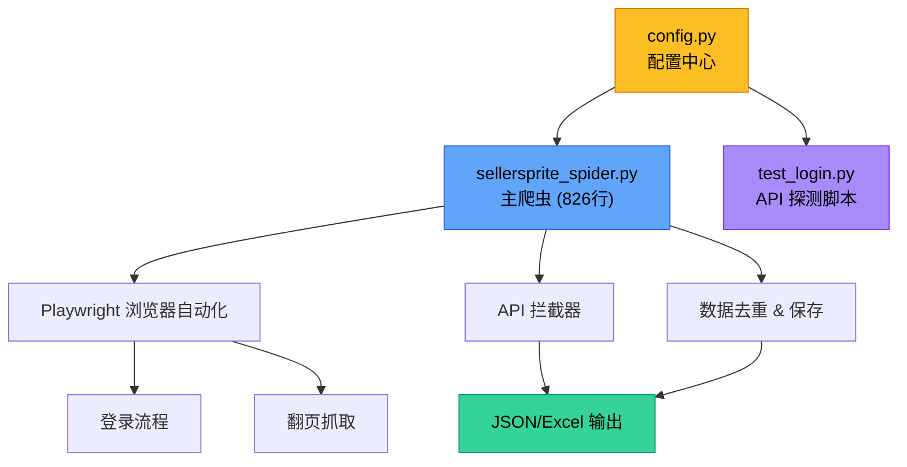
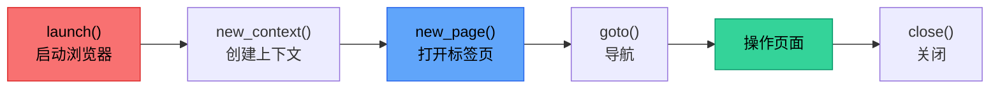
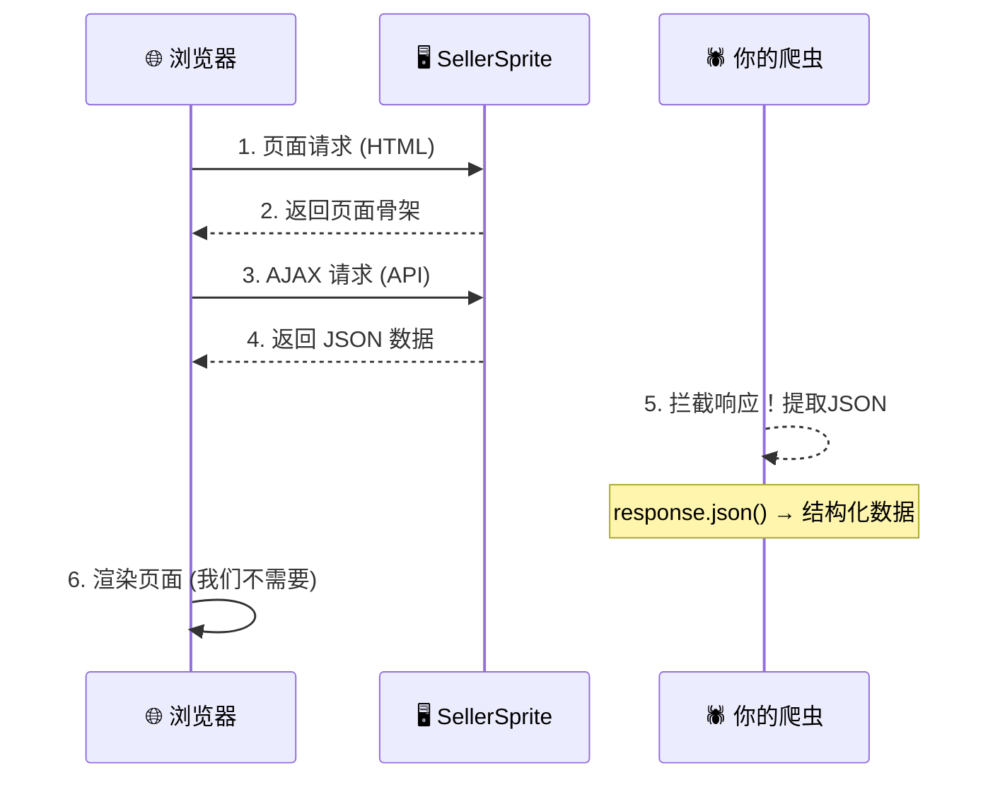
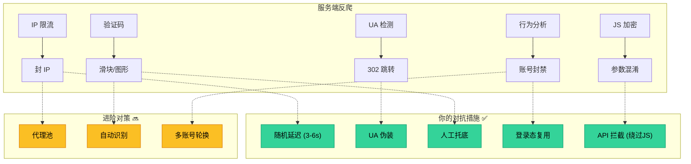

# 🕷️ 爬虫学习路线 — 基于 SellerSprite Spider 项目

> 以你现有的 **SellerSprite 卖家精灵爬虫** 为教材，从零到进阶系统学习爬虫技术。
> 每一阶段都会指出"你的代码里哪几行对应这个知识点"，让你**带着真实项目学**。

---

## 📊 项目架构总览



你的项目使用了一种**高级爬虫模式**：不直接解析 HTML，而是通过 Playwright 控制浏览器 → 拦截 API 响应 → 直接获取结构化 JSON 数据。这比传统爬虫更强大，但也需要更多前置知识。

---

## Lv.0 🐣 Python 基础（前置条件）

> **目标**：看懂爬虫代码里的 Python 语法

### 核心知识点

| 知识点 | 你的代码中的体现 | 说明 |
|--------|------------------|------|
| **类和对象** | [sellersprite_spider.py:47-57](file:///d:/snf/git/scrapy/sellersprite_spider.py#L47-L57) `class SellerSpriteSpider` | 整个爬虫封装为一个类 |
| **async/await** | [sellersprite_spider.py:62](file:///d:/snf/git/scrapy/sellersprite_spider.py#L62) `async def run()` | 异步编程，爬虫核心范式 |
| **异常处理** | [sellersprite_spider.py:129-134](file:///d:/snf/git/scrapy/sellersprite_spider.py#L129-L134) `try/except/finally` | 即使出错也保存已获取的数据 |
| **列表推导/字典操作** | [sellersprite_spider.py:783-813](file:///d:/snf/git/scrapy/sellersprite_spider.py#L783-L813) `_deduplicate()` | 用 set 去重，JSON 哈希 |
| **f-string 格式化** | [config.py:58](file:///d:/snf/git/scrapy/config.py#L58) `f"sellersprite_automotive_{datetime...}"` | 动态文件名构造 |
| **上下文管理器** | [sellersprite_spider.py:75](file:///d:/snf/git/scrapy/sellersprite_spider.py#L75) `async with async_playwright()` | 资源自动释放 |

### 🎯 练习

1. 用 `class` 写一个简单的 `DataCollector` 类，包含 `add_item()` 和 `get_stats()` 方法
2. 写一个 `async` 函数，用 `asyncio.sleep()` 模拟网络延迟
3. 理解 `try/except/finally` 的执行顺序 — 修改 [sellersprite_spider.py:129-141](file:///d:/snf/git/scrapy/sellersprite_spider.py#L129-L141)，添加 `print` 观察

### 📚 推荐资源

- 《Python Crash Course》第 9-10 章（类与文件）
- Real Python: [Async IO in Python](https://realpython.com/async-io-python/)

---

## Lv.1 🌐 HTTP 协议与网页基础

> **目标**：理解爬虫到底在"爬"什么

### 核心知识点

| 知识点 | 你的代码中的体现 |
|--------|------------------|
| **URL 结构** | [sellersprite_spider.py:455-467](file:///d:/snf/git/scrapy/sellersprite_spider.py#L455-L467) — 查看 URL 参数如何构造 |
| **HTTP 状态码** | [sellersprite_spider.py:377](file:///d:/snf/git/scrapy/sellersprite_spider.py#L377) `response.status != 200` — 只处理成功响应 |
| **Content-Type** | [sellersprite_spider.py:380-381](file:///d:/snf/git/scrapy/sellersprite_spider.py#L380-L381) — 通过 header 判断响应类型 |
| **URL Encoding** | [config.py:69-71](file:///d:/snf/git/scrapy/config.py#L69-L71) — `%5B%5D` 就是 `[]` 的编码 |
| **Cookie / Session** | [sellersprite_spider.py:83-86](file:///d:/snf/git/scrapy/sellersprite_spider.py#L83-L86) — `storage_state` 保存登录态 |

### 🔍 深入理解你的 URL

```
https://www.sellersprite.com/v3/product-research?
  market=US              ← 查询参数：目标市场
  &page=1                ← 分页参数
  &size=60               ← 每页条数
  &nodeIdPaths=%5B%22    ← URL编码的 JSON 数组
    15684181%22%5D
  &minSales=100          ← 筛选条件
  &order%5Bfield%5D=     ← order[field] 的编码形式
    amz_unit
```

### 🎯 练习

1. 打开浏览器 DevTools (F12) → Network 面板，访问任意网站，观察请求/响应
2. 手动解码 [sellersprite_spider.py:462-466](file:///d:/snf/git/scrapy/sellersprite_spider.py#L462-L466) 中的 `%5B%5D` → 理解 URL encoding
3. 用 Python 的 `requests` 库发送一个 GET 请求，打印 `status_code` 和 `headers`

### 📚 推荐资源

- MDN: [HTTP 概述](https://developer.mozilla.org/zh-CN/docs/Web/HTTP/Overview)
- Chrome DevTools Network 面板文档

---

## Lv.2 🎭 Playwright 浏览器自动化

> **目标**：掌握你的爬虫的**核心引擎**
> 你的项目不用 requests 发请求，而是用 Playwright 操控真实浏览器

### 核心知识点

#### 2.1 浏览器生命周期管理



| 操作 | 代码位置 | 说明 |
|------|----------|------|
| **启动浏览器** | [sellersprite_spider.py:78-81](file:///d:/snf/git/scrapy/sellersprite_spider.py#L78-L81) | `pw.chromium.launch()` + 反自动化检测参数 |
| **浏览器上下文** | [sellersprite_spider.py:85-102](file:///d:/snf/git/scrapy/sellersprite_spider.py#L85-L102) | `new_context()` 设置 viewport、UA、复用登录态 |
| **页面导航** | [sellersprite_spider.py:475-476](file:///d:/snf/git/scrapy/sellersprite_spider.py#L475-L476) | `page.goto()` + `wait_until` 策略 |
| **等待策略** | [sellersprite_spider.py:161](file:///d:/snf/git/scrapy/sellersprite_spider.py#L161) | `networkidle` vs `domcontentloaded` |

#### 2.2 元素选择器与交互

| 操作 | 代码位置 | 选择器示例 |
|------|----------|-----------|
| **CSS 选择器** | [sellersprite_spider.py:242-261](file:///d:/snf/git/scrapy/sellersprite_spider.py#L242-L261) | `input[name="username"]`, `input[type="password"]` |
| **文本选择器** | [sellersprite_spider.py:264-266](file:///d:/snf/git/scrapy/sellersprite_spider.py#L264-L266) | `button:has-text("登录")` — Playwright 特有语法 |
| **填写表单** | [sellersprite_spider.py:278-280](file:///d:/snf/git/scrapy/sellersprite_spider.py#L278-L280) | `click()` → `fill("")` → `type(text, delay=50)` |
| **等待元素** | [sellersprite_spider.py:548](file:///d:/snf/git/scrapy/sellersprite_spider.py#L548) | `wait_for_selector(sel, timeout=15000)` |

#### 2.3 登录状态持久化

你的代码实现了一个很实用的模式 — **登录态复用**：

```python
# 保存登录状态 → 下次无需重新登录
await context.storage_state(path=state_file)     # 保存
context = await browser.new_context(
    storage_state=state_file                      # 复用
)
```

对应代码：[sellersprite_spider.py:83-86](file:///d:/snf/git/scrapy/sellersprite_spider.py#L83-L86)（复用）和 [sellersprite_spider.py:138](file:///d:/snf/git/scrapy/sellersprite_spider.py#L138)（保存）

### 🎯 练习

1. 用 Playwright 写一个脚本，自动打开百度、输入关键词、点击搜索、截图保存
2. 改造 [test_login.py](file:///d:/snf/git/scrapy/test_login.py)，在登录成功后自动截取 5 张不同页面的截图
3. 实验不同的 `wait_until` 策略：`"load"` / `"domcontentloaded"` / `"networkidle"`，观察行为差异

### 📚 推荐资源

- [Playwright Python 官方文档](https://playwright.dev/python/docs/intro)
- [Playwright 选择器指南](https://playwright.dev/python/docs/selectors)

---

## Lv.3 📡 API 拦截与数据提取（你的爬虫核心技巧）

> **目标**：掌握"不解析 HTML，直接截获 API 数据"的高级模式
> 这是你的爬虫最精妙的设计

### 核心概念



### 关键代码解析

#### 3.1 注册响应拦截器

[sellersprite_spider.py:356-447](file:///d:/snf/git/scrapy/sellersprite_spider.py#L356-L447) — 这是整个爬虫最核心的部分：

```python
# 注册事件监听 — 每个 HTTP 响应都会触发 on_response
self.page.on("response", on_response)
```

#### 3.2 API 端点匹配

[sellersprite_spider.py:363-370](file:///d:/snf/git/scrapy/sellersprite_spider.py#L363-L370) — 用模式匹配找到正确的 API：

```python
api_patterns = [
    "/v3/product/research",
    "/v3/api/product",
    "/product-research/page",
    ...
]
is_api = any(p in url for p in api_patterns)
```

#### 3.3 自适应数据结构解析

[sellersprite_spider.py:398-416](file:///d:/snf/git/scrapy/sellersprite_spider.py#L398-L416) — 兼容多种 API 返回格式：

```python
# 尝试多种可能的字段名
items = (
    data.get("items")       # 格式1: {data: {items: [...]}}
    or data.get("records")  # 格式2: {data: {records: [...]}}
    or data.get("list")     # 格式3: {data: {list: [...]}}
    or data.get("rows")     # 格式4: ...
)
```

> [!TIP]
> 这种"防御性解析"是生产代码的好习惯 — 不硬编码 API 结构，而是兼容多种可能。

### 🎯 练习

1. **API 探测**：运行 [test_login.py](file:///d:/snf/git/scrapy/test_login.py)，观察输出的 API 端点和数据结构
2. **简化练习**：用 Playwright 打开任意电商网站（如淘宝搜索结果页），用 `page.on("response", ...)` 拦截所有 JSON 响应，打印它们的 URL
3. **数据对比**：同时运行 API 拦截和 DOM 抓取（[sellersprite_spider.py:691-717](file:///d:/snf/git/scrapy/sellersprite_spider.py#L691-L717)），对比两种方式获取的数据完整度

### 📚 推荐资源

- [Playwright Network Events](https://playwright.dev/python/docs/network)
- Chrome DevTools: 学会在 Network 面板中 Filter `XHR` 请求

---

## Lv.4 🛡️ 反爬策略与对抗

> **目标**：理解为什么你的代码要做这么多"多余"的事

### 你的代码中的反反爬措施

| 策略 | 代码位置 | 原理 |
|------|----------|------|
| **UA 伪装** | [sellersprite_spider.py:88-92](file:///d:/snf/git/scrapy/sellersprite_spider.py#L88-L92) | 模拟真实 Chrome 浏览器的 User-Agent |
| **反自动化检测** | [sellersprite_spider.py:80](file:///d:/snf/git/scrapy/sellersprite_spider.py#L80) | `--disable-blink-features=AutomationControlled` 隐藏自动化特征 |
| **随机延迟** | [sellersprite_spider.py:599](file:///d:/snf/git/scrapy/sellersprite_spider.py#L599) | `random.uniform(3, 6)` 模拟人类行为 |
| **打字延迟** | [sellersprite_spider.py:280](file:///d:/snf/git/scrapy/sellersprite_spider.py#L280) | `type(text, delay=50)` 模拟真人输入速度 |
| **登录态复用** | [sellersprite_spider.py:83-86](file:///d:/snf/git/scrapy/sellersprite_spider.py#L83-L86) | 减少登录频率，降低触发风控概率 |
| **验证码检测** | [sellersprite_spider.py:337-343](file:///d:/snf/git/scrapy/sellersprite_spider.py#L337-L343) | 检测到验证码时暂停，等待人工操作 |
| **重试机制** | [sellersprite_spider.py:611-619](file:///d:/snf/git/scrapy/sellersprite_spider.py#L611-L619) | 翻页失败自动重试 |

### 反爬策略全景图



### 🎯 练习

1. 在 [config.py](file:///d:/snf/git/scrapy/config.py) 中把 `PAGE_DELAY_MIN/MAX` 改成 `0/0`，观察是否被封
2. 移除 `--disable-blink-features=AutomationControlled`，在 [https://bot.sannysoft.com/](https://bot.sannysoft.com/) 检测差异
3. 为爬虫添加**代理支持**：修改 `launch()` 加入 `proxy={"server": "http://proxy:port"}`

---

## Lv.5 📊 数据处理与存储

> **目标**：学会清洗、去重、保存爬取的数据

### 你的代码中的数据处理

| 操作 | 代码位置 | 技术 |
|------|----------|------|
| **JSON 保存** | [sellersprite_spider.py:735-757](file:///d:/snf/git/scrapy/sellersprite_spider.py#L735-L757) | 带元数据的结构化输出 |
| **Excel 保存** | [sellersprite_spider.py:760-767](file:///d:/snf/git/scrapy/sellersprite_spider.py#L760-L767) | `pd.json_normalize()` 扁平化嵌套 JSON |
| **数据去重** | [sellersprite_spider.py:783-813](file:///d:/snf/git/scrapy/sellersprite_spider.py#L783-L813) | ASIN 去重 + JSON 哈希去重双保险 |
| **Checkpoint** | [sellersprite_spider.py:622-624](file:///d:/snf/git/scrapy/sellersprite_spider.py#L622-L624) | 每 10 页保存中间结果，防丢失 |

### 去重算法详解

```python
# 方案1: 有唯一标识 (如 ASIN) → O(1) 查重
if asin not in seen_set:
    seen_set.add(asin)
    unique.append(product)

# 方案2: 无唯一标识 → JSON 序列化哈希
key = json.dumps(product, sort_keys=True)  # 确保字段顺序一致
if key not in seen_set: ...
```

### 🎯 练习

1. 在 `_save_data()` 中添加 CSV 格式输出
2. 将数据保存到 SQLite 数据库（`import sqlite3`）
3. 用 Pandas 对爬取的数据做分析：按品牌统计销量 TOP 10、价格分布直方图

---

## Lv.6 🚀 进阶方向

> 掌握前面的内容后，选择感兴趣的方向深入

### 方向一：Scrapy 框架

你当前的爬虫是"单文件脚本"模式。Scrapy 是专业的爬虫框架，提供：

| 特性 | 你的现有方案 | Scrapy |
|------|-------------|--------|
| 并发控制 | 手动 `asyncio.sleep` | 内置 `CONCURRENT_REQUESTS` |
| 数据管道 | 手写 `_save_data()` | Item Pipeline 机制 |
| 中间件 | 硬编码 UA/延迟 | Middleware 可插拔 |
| 去重 | 手写 `_deduplicate` | 内置 `dont_filter` |
| 分布式 | ❌ | Scrapy-Redis |

### 方向二：数据库 & 增量爬取

```
首次爬取 → 全量入库 (SQLite/MongoDB)
后续爬取 → 与数据库对比 → 只存新数据/更新数据
```

### 方向三：可视化监控

- Grafana + Prometheus 监控爬虫状态
- 实时展示爬取进度、成功率、数据量

### 方向四：法律与伦理

> [!CAUTION]
> 爬虫开发务必注意法律边界：
> - 遵守 `robots.txt` 协议
> - 不爬取个人隐私数据
> - 控制爬取频率，不影响目标网站正常运行
> - 商业用途需确认数据许可协议

---

## 📅 建议学习计划

| 周数 | 阶段 | 重点内容 | 预计时间 |
|------|------|----------|----------|
| 第 1 周 | Lv.0 | Python async/类/异常处理 | 10h |
| 第 2 周 | Lv.1 | HTTP 协议、DevTools 使用 | 6h |
| 第 3-4 周 | Lv.2 | Playwright 浏览器自动化 | 15h |
| 第 5-6 周 | Lv.3 | API 拦截与数据提取 | 15h |
| 第 7 周 | Lv.4 | 反爬对抗策略 | 8h |
| 第 8 周 | Lv.5 | Pandas 数据处理 | 8h |
| 第 9+ 周 | Lv.6 | 选择进阶方向深入 | 自定 |

> [!TIP]
> **最佳学习方式**：每学一个知识点，就回到你的 `sellersprite_spider.py` 中找到对应代码，读懂它 → 改一改 → 运行看效果。**不要光看教程，要动手改代码。**

---

## 🔧 立即可做的第一步

1. 安装依赖：`pip install -r requirements.txt && playwright install chromium`
2. 运行 [test_login.py](file:///d:/snf/git/scrapy/test_login.py)，完成登录，观察 API 探测输出
3. 打开 [sellersprite_spider.py](file:///d:/snf/git/scrapy/sellersprite_spider.py)，从 `run()` 方法（[第62行](file:///d:/snf/git/scrapy/sellersprite_spider.py#L62)）开始，跟着注释从上往下通读一遍

